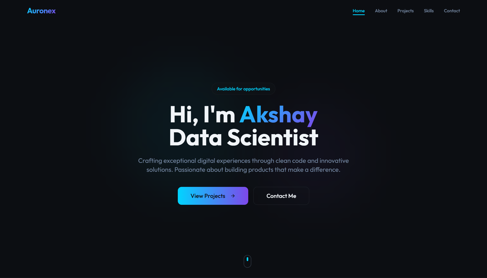

# 🌐 Auronex – Personal Portfolio Website

A modern, full-stack **personal portfolio website** built to showcase my skills, projects, and experience as a developer.  
This project demonstrates real-world full-stack development using modern tools and best practices.

---

## 🔗 Live Website

👉 https://auronex-portfolio.vercel.app

---

## 👨‍💻 About Me

I’m **Axay Mathukiya**, a passionate developer focused on building scalable, clean, and user-friendly web applications.  
This portfolio showcases my skills, projects, and provides a way to contact me directly.

---

## 🛠 Tech Stack

### Frontend
- React.js (Vite)
- Tailwind CSS
- JavaScript
- Responsive UI

### Backend
- Node.js
- Express.js
- PostgreSQL

### Services & Tools
- Render (Backend & Database)
- Vercel (Frontend Hosting)
- Brevo (Email Service)
- Git & GitHub

---

## ✨ Features

- Professional portfolio UI
- Contact form with backend integration
- Email notifications on form submission
- Data stored securely in PostgreSQL
- Clean and scalable project structure
- Fully responsive design

---

## 📸 Screenshots

### 🏠 Home Page


## 📁 Project Structure
```bash
auronex-portfolio/
│
├── backend/
│ ├── utils/
│ ├── db.js
│ ├── server.js
│ ├── package.json
│ └── .env
│
├── frontend/
│ ├── src/
│ ├── public/
│ ├── package.json
│ └── vite.config.js
│
├── .gitignore
└── README.md
```

---

## ⚙️ Setup Instructions

1️⃣ Clone Repository
```bash
git clone https://github.com/axaymathukiya27-tech/auronex-portfolio.git
cd auronex-portfolio
```
2️⃣ Backend Setup
```bash
cd backend
npm install
```

Create .env file:
```bash
PORT=5000
DATABASE_URL=your_postgres_url
BREVO_API_KEY=your_brevo_api_key
CONTACT_FROM_EMAIL=your_verified_email
```

Run backend:
```bash
npm start
```

3️⃣ Frontend Setup
```bash
cd ../frontend
npm install
npm run dev
```

Visit:
```bash
http://localhost:5173
```
## 📨 Contact System Workflow

1. User submits the contact form  
2. Data is saved to the PostgreSQL database  
3. Email notification is sent via Brevo  
4. User receives confirmation  

---

## 📦 Database Schema

```sql
CREATE TABLE contacts (
  id SERIAL PRIMARY KEY,
  name TEXT NOT NULL,
  email TEXT NOT NULL,
  subject TEXT,
  message TEXT,
  created_at TIMESTAMP DEFAULT CURRENT_TIMESTAMP
);
```

## 🚀 Deployment

- **Frontend:** Vercel  
- **Backend:** Render  
- **Database:** Render PostgreSQL  

---

## 👨‍💻 Author

**Axay Mathukiya**  
Aspiring Full-Stack Developer  

🔗 GitHub: https://github.com/axaymathukiya27-tech  
🌐 Portfolio: https://auronex-portfolio.vercel.app  

---

## 🙌 Acknowledgements

Thanks for checking out my portfolio!  
Feel free to connect, collaborate, or provide feedback.

⭐ If you like this project, consider starring the repository!
